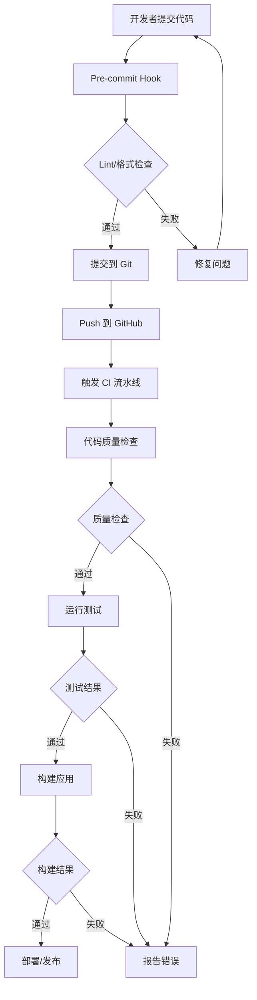
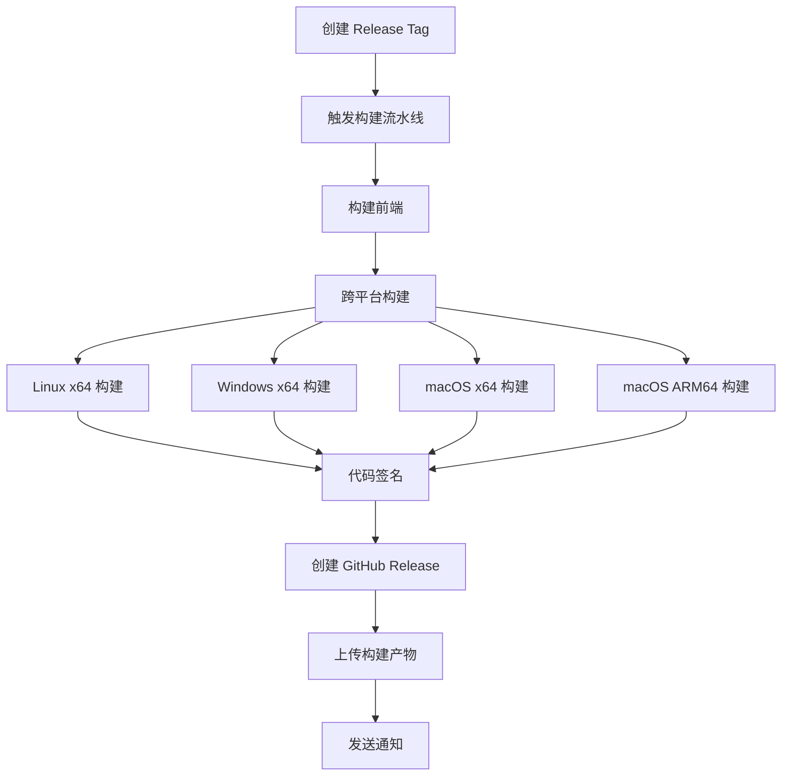

# Reeftotem Assistant CI/CD 实施指南

## 📋 实施概述

本文档提供了 reeftotem-assistant 项目完整 CI/CD 自动化方案的实施步骤和配置说明。

## 🚀 快速开始

### 1. 准备工作

#### 必需的 GitHub Secrets
在 GitHub 仓库设置中添加以下 Secrets：

```bash
# Tauri 签名密钥
TAURI_PRIVATE_KEY=your_tauri_private_key
TAURI_KEY_PASSWORD=your_key_password

# 代码签名证书
MACOS_SIGNING_CERT=your_macos_signing_cert_base64
MACOS_CERT_PASSWORD=your_cert_password
MACOS_KEYCHAIN_PASSWORD=your_keychain_password
MACOS_SIGNING_IDENTITY=Developer ID Application: Your Name
MACOS_NOTARY_API_KEY=your_notary_api_key
MACOS_NOTARY_KEY_ID=your_key_id
MACOS_NOTARY_ISSUER_ID=your_issuer_id

WINDOWS_SIGNING_CERT=your_windows_signing_cert_base64
WINDOWS_CERT_PASSWORD=your_cert_password

# 安全扫描
SNYK_TOKEN=your_snyk_token

# 通知服务（可选）
SLACK_WEBHOOK_URL=your_slack_webhook_url
DISCORD_WEBHOOK_URL=your_discord_webhook_url
```

#### 环境依赖
确保开发环境已安装：
- Node.js 20+
- Rust 1.75+
- pnpm 8+
- Docker（可选，用于容器扫描）

### 2. 安装开发依赖

```bash
# 安装 Node.js 依赖
pnpm install

# 安装开发工具依赖
pnpm add -D \
  @typescript-eslint/eslint-plugin \
  @typescript-eslint/parser \
  @vitest/coverage-v8 \
  @playwright/test \
  eslint \
  eslint-plugin-react \
  eslint-plugin-react-hooks \
  eslint-plugin-jsx-a11y \
  eslint-plugin-import \
  eslint-plugin-prefer-arrow \
  prettier \
  vitest \
  jsdom \
  @testing-library/react \
  @testing-library/jest-dom \
  @testing-library/user-event \
  husky \
  lint-staged \
  typedoc \
  markdownlint-cli2 \
  cspell

# 安装 Rust 工具
cargo install cargo-audit cargo-deny cargo-license rustfmt
```

### 3. 配置 Git Hooks

```bash
# 安装 husky
pnpm prepare

# 创建 pre-commit hook
cat > .husky/pre-commit << 'EOF'
#!/usr/bin/env sh
. "$(dirname -- "$0")/_/husky.sh"

pnpm lint-staged
EOF

# 创建 commit-msg hook
cat > .husky/commit-msg << 'EOF'
#!/usr/bin/env sh
. "$(dirname -- "$0")/_/husky.sh"

npx --no -- commitlint --edit ${1}
EOF

# 添加可执行权限
chmod +x .husky/pre-commit .husky/commit-msg
```

### 4. 更新 package.json 开发依赖

将以下依赖添加到 `package.json` 的 `devDependencies`：

```json
{
  "devDependencies": {
    "@typescript-eslint/eslint-plugin": "^6.0.0",
    "@typescript-eslint/parser": "^6.0.0",
    "@vitest/coverage-v8": "^1.0.0",
    "@playwright/test": "^1.40.0",
    "eslint": "^8.0.0",
    "eslint-plugin-react": "^7.33.0",
    "eslint-plugin-react-hooks": "^4.6.0",
    "eslint-plugin-jsx-a11y": "^6.8.0",
    "eslint-plugin-import": "^2.29.0",
    "eslint-plugin-prefer-arrow": "^1.2.3",
    "prettier": "^3.1.0",
    "vitest": "^1.0.0",
    "jsdom": "^23.0.0",
    "@testing-library/react": "^14.0.0",
    "@testing-library/jest-dom": "^6.1.0",
    "@testing-library/user-event": "^14.5.0",
    "husky": "^8.0.3",
    "lint-staged": "^15.2.0",
    "typedoc": "^0.25.0",
    "markdownlint-cli2": "^0.10.0",
    "cspell": "^8.0.0",
    "@commitlint/cli": "^18.4.0",
    "@commitlint/config-conventional": "^18.4.0",
    "rimraf": "^5.0.5"
  }
}
```

### 5. 配置 lint-staged

在 `package.json` 中添加：

```json
{
  "lint-staged": {
    "*.{ts,tsx,js,jsx}": [
      "eslint --fix",
      "prettier --write"
    ],
    "*.{json,css,md}": [
      "prettier --write"
    ],
    "*.rs": [
      "rustfmt --",
      "cargo clippy -- -D warnings"
    ]
  }
}
```

### 6. 配置 commitlint

创建 `commitlint.config.js`：

```javascript
module.exports = {
  extends: ['@commitlint/config-conventional'],
  rules: {
    'type-enum': [
      2,
      'always',
      [
        'feat',     // 新功能
        'fix',      // 修复
        'docs',     // 文档
        'style',    // 格式
        'refactor', // 重构
        'perf',     // 性能
        'test',     // 测试
        'chore',    // 构建/工具
        'ci',       // CI配置
        'build',    // 构建系统
        'revert',   // 回滚
        'release',  // 发布
      ],
    ],
    'subject-max-length': [2, 'always', 50],
    'body-max-line-length': [2, 'always', 72],
  },
};
```

## 📁 文件结构

创建以下文件结构：

```
reeftotem-assistant/
├── .github/
│   └── workflows/
│       ├── ci.yml              # 主 CI/CD 流水线
│       ├── build-release.yml   # 构建和发布
│       ├── security.yml        # 安全扫描
│       ├── docs.yml            # 文档构建
│       └── maintenance.yml     # 维护任务
├── src/
│   └── test/
│       └── setup.ts            # 测试设置
├── e2e/
│   └── basic.spec.ts           # E2E 测试
├── docs/
│   └── (文档文件)
├── .eslintrc.json              # ESLint 配置
├── .prettierrc.json            # Prettier 配置
├── .rustfmt.toml               # Rust 格式化配置
├── deny.toml                   # Rust 依赖检查配置
├── .cspell.json                # 拼写检查配置
├── vitest.config.ts            # 单元测试配置
├── playwright.config.ts        # E2E 测试配置
├── mkdocs.yml                  # 文档构建配置
├── commitlint.config.js        # 提交信息检查
└── CICD_IMPLEMENTATION_GUIDE.md # 本文档
```

## 🔄 工作流程说明

### 1. 代码提交流程



### 2. 发布流程



## 🧪 测试策略

### 1. 单元测试

**创建测试文件示例：**

```typescript
// src/hooks/__tests__/useAudioRecorder.test.ts
import { renderHook, act } from '@testing-library/react';
import { useAudioRecorder } from '../useAudioRecorder';

describe('useAudioRecorder', () => {
  it('should initialize with correct default state', () => {
    const { result } = renderHook(() => useAudioRecorder());

    expect(result.current.isRecording).toBe(false);
    expect(result.current.audioBlob).toBeNull();
    expect(result.current.error).toBeNull();
  });

  it('should start recording when startRecording is called', async () => {
    const { result } = renderHook(() => useAudioRecorder());

    await act(async () => {
      await result.current.startRecording();
    });

    expect(result.current.isRecording).toBe(true);
  });
});
```

### 2. E2E 测试

**测试关键用户流程：**

```typescript
// e2e/voice-interaction.spec.ts
import { test, expect } from '@playwright/test';

test('语音交互完整流程', async ({ page }) => {
  await page.goto('/');

  // 1. 打开语音录制
  await page.click('[data-testid="voice-button"]');
  await expect(page.locator('[data-testid="recording-indicator"]')).toBeVisible();

  // 2. 停止录制
  await page.click('[data-testid="voice-button"]');
  await expect(page.locator('[data-testid="recording-indicator"]')).not.toBeVisible();

  // 3. 验证识别结果
  await expect(page.locator('[data-testid="asr-result"]')).toBeVisible();

  // 4. 验证 AI 回复
  await expect(page.locator('[data-testid="ai-response"]')).toBeVisible();
});
```

## 🔒 安全最佳实践

### 1. 密钥管理

```typescript
// 使用环境变量示例
const config = {
  tencentCloud: {
    secretId: import.meta.env.VITE_TENCENT_SECRET_ID,
    secretKey: import.meta.env.VITE_TENCENT_SECRET_KEY,
    region: import.meta.env.VITE_TENCENT_REGION || 'ap-beijing',
    appId: import.meta.env.VITE_TENCENT_APP_ID,
  },

  // 验证必需配置
  validate() {
    const required = ['secretId', 'secretKey', 'appId'];
    const missing = required.filter(key => !this.tencentCloud[key]);

    if (missing.length > 0) {
      throw new Error(`Missing required config: ${missing.join(', ')}`);
    }
  }
};
```

### 2. 输入验证

```typescript
// 语音数据验证
export function validateAudioData(audioData: ArrayBuffer): boolean {
  // 检查数据大小
  const MAX_SIZE = 10 * 1024 * 1024; // 10MB
  if (audioData.byteLength > MAX_SIZE) {
    return false;
  }

  // 检查音频格式
  const header = new Uint8Array(audioData.slice(0, 4));
  const isValidFormat = header[0] === 0x52 && header[1] === 0x49 && // 'RIFF'
                        header[2] === 0x46 && header[3] === 0x46;

  return isValidFormat;
}
```

## 📊 监控和报告

### 1. 测试覆盖率报告

测试完成后自动生成覆盖率报告：

```bash
# 生成覆盖率报告
pnpm test:coverage

# 查看报告
open coverage/index.html
```

### 2. 构建指标

在 GitHub Actions 中收集构建指标：

```yaml
- name: Collect build metrics
  run: |
    echo "## 📊 Build Metrics" >> $GITHUB_STEP_SUMMARY
    echo "| Metric | Value |" >> $GITHUB_STEP_SUMMARY
    echo "|--------|-------|" >> $GITHUB_STEP_SUMMARY
    echo "| Build time | ${{ job.status }} |" >> $GITHUB_STEP_SUMMARY
    echo "| Test coverage | $(cat coverage/coverage-summary.json | jq '.total.lines.pct')% |" >> $GITHUB_STEP_SUMMARY
```

## 🚨 故障排除

### 1. 常见问题

#### 问题：Tauri 构建失败
```bash
# 解决方案：清理并重新安装依赖
pnpm clean:deps
pnpm install
cd src-tauri && cargo clean
```

#### 问题：跨平台构建签名失败
```bash
# 检查证书配置
echo $TAURI_PRIVATE_KEY | base64 -d > private_key.pem
openssl rsa -in private_key.pem -check
```

#### 问题：E2E 测试不稳定
```typescript
// 增加等待时间
await page.waitForTimeout(2000);
await expect(element).toBeVisible({ timeout: 10000 });
```

### 2. 调试技巧

#### 本地调试 GitHub Actions
```bash
# 使用 act 工具本地运行
act -j build-check
```

#### 查看详细日志
```yaml
- name: Debug step
  run: |
    set -x  # 启用详细输出
    your-command-here
```

## 📈 性能优化

### 1. 缓存策略

```yaml
# 优化依赖缓存
- name: Cache pnpm
  uses: actions/cache@v3
  with:
    path: ~/.pnpm-store
    key: ${{ runner.os }}-pnpm-${{ hashFiles('**/pnpm-lock.yaml') }}
    restore-keys: |
      ${{ runner.os }}-pnpm-
```

### 2. 并行化构建

```yaml
# 并行运行测试
strategy:
  matrix:
    test-group: [unit, integration, e2e]
```

## 🎯 下一步计划

### 短期目标（1-2周）
- [ ] 完善单元测试覆盖
- [ ] 添加更多 E2E 测试场景
- [ ] 配置代码覆盖率报告
- [ ] 设置安全扫描

### 中期目标（1-2月）
- [ ] 实现自动化依赖更新
- [ ] 添加性能测试
- [ ] 配置监控和告警
- [ ] 优化构建时间

### 长期目标（3-6月）
- [ ] 实现蓝绿部署
- [ ] 添加 A/B 测试
- [ ] 配置自动化回滚
- [ ] 建立完整的 DevOps 流程

## 📞 支持和联系

如果在实施过程中遇到问题，请：

1. 查看本文档的故障排除部分
2. 检查 GitHub Actions 的运行日志
3. 提交 Issue 到项目仓库
4. 联系项目维护者

---

*本文档会根据项目发展持续更新，最后更新时间：2025-10-25*