# Reeftotem Assistant - 项目架构总览

## 变更记录 (Changelog)

- **2025-10-25 增量扫描完成** - 深度扫描高优先级模块，新增 Voice、Hooks、Stores、Utils 模块详细文档
- **2025-10-25 13:37:29** - 初始化架构分析，完成全仓清点和模块扫描
- **项目概览** - reeftotem-assistant v0.2.0 - 基于 Tauri + React 的 Live2D 语音助手应用

## 项目愿景

Reeftotem Assistant 是一个桌面端的 Live2D 虚拟助手应用，结合了先进的语音识别、语音合成技术和生动的 2D 人物动画，为用户提供沉浸式的 AI 交互体验。

## 架构总览

### 技术栈
- **前端框架**: React 19.x + TypeScript
- **桌面框架**: Tauri 2.x (Rust 后端)
- **UI 组件库**: shadcn/ui + Tailwind CSS 4.x
- **动画引擎**: Live2D SDK + PixiJS
- **语音服务**: 腾讯云 ASR/TTS
- **状态管理**: Zustand
- **构建工具**: Vite 7.x

### 架构模式
- **混合架构**: Tauri 提供桌面容器，React 负责用户界面
- **事件驱动**: 前后端通过 Tauri events 进行通信
- **模块化设计**: 功能按模块划分，便于维护和扩展

## 模块结构图

```mermaid
graph TD
    A["(根) reeftotem-assistant"] --> B["src"];
    A --> C["src-tauri"];
    A --> D["docs"];
    A --> E["配置文件"];

    B --> F["components"];
    B --> G["pages"];
    B --> H["lib"];
    B --> I["hooks"];
    B --> J["stores"];
    B --> K["utils"];
    B --> L["configs"];

    F --> F1["ChatInterface"];
    F --> F2["Live2D"];
    F --> F3["Voice"];
    F --> F4["ui"];

    G --> G1["Live2DWindow"];
    G --> G2["DirectASRTestPage"];

    H --> H1["live2d"];
    H --> H2["ai"];
    H --> H3["audio"];
    H --> H4["tauriApi"];

    I --> I1["useLive2D*"];
    I --> I2["useAudioRecorder"];
    I --> I3["useDragEdgeDetection"];

    C --> C1["main.rs"];
    C --> C2["lib.rs"];
    C --> C3["窗口管理"];
    C --> C4["托盘菜单"];
    C --> C5["边缘检测"];

    click F1 "./src/components/ChatInterface/CLAUDE.md" "查看 ChatInterface 模块文档"
    click F2 "./src/components/Live2D/CLAUDE.md" "查看 Live2D 模块文档"
    click F3 "./src/components/Voice/CLAUDE.md" "查看 Voice 模块文档"
    click G1 "./src/pages/Live2DWindow/CLAUDE.md" "查看 Live2DWindow 模块文档"
    click H1 "./src/lib/live2d/CLAUDE.md" "查看 Live2D 库模块文档"
    click H2 "./src/lib/ai/CLAUDE.md" "查看 AI 服务模块文档"
    click C1 "./src-tauri/src/CLAUDE.md" "查看 Tauri 后端模块文档"
    click I1 "./src/hooks/CLAUDE.md" "查看 Hooks 模块文档"
    click J1 "./src/stores/CLAUDE.md" "查看 Stores 模块文档"
    click K1 "./src/utils/CLAUDE.md" "查看 Utils 模块文档"
```



## 模块索引

| 模块路径 | 类型 | 主要职责 | 入口文件 | 状态 | 文档 |
|---------|------|----------|----------|------|------|
| `src/components/ChatInterface` | React组件 | 主聊天界面，集成多标签页交互 | `ChatInterface.tsx` | ✅ 核心 | [📄](./src/components/ChatInterface/CLAUDE.md) |
| `src/components/Live2D` | React组件 | Live2D角色渲染和交互 | `Live2DComponents.jsx` | ✅ 核心 | [📄](./src/components/Live2D/CLAUDE.md) |
| `src/components/Voice` | React组件 | 语音录制、识别和合成功能 | `Live2DVoiceInteraction.tsx` | ✅ 核心 | [📄](./src/components/Voice/CLAUDE.md) |
| `src/pages/Live2DWindow` | React页面 | Live2D独立窗口页面 | `Live2DWindow.tsx` | ✅ 核心 | [📄](./src/pages/Live2DWindow/CLAUDE.md) |
| `src/lib/live2d` | TS库 | Live2D SDK封装和核心逻辑 | `Live2DManager.ts` | ✅ 核心 | [📄](./src/lib/live2d/CLAUDE.md) |
| `src/lib/ai` | TS库 | AI语音服务集成 | `TencentCloudVoiceService.ts` | ✅ 核心 | [📄](./src/lib/ai/CLAUDE.md) |
| `src-tauri/src` | Rust库 | 桌面应用后端功能 | `lib.rs` | ✅ 核心 | [📄](./src-tauri/src/CLAUDE.md) |
| `src/hooks` | React Hooks | 可复用的状态和逻辑 | `useAudioRecorder.ts` | ✅ 成熟 | [📄](./src/hooks/CLAUDE.md) |
| `src/stores` | 状态管理 | 全局状态管理 | `chat-store.ts` | ✅ 成熟 | [📄](./src/stores/CLAUDE.md) |
| `src/utils` | 工具函数 | 通用工具和辅助函数 | `edgeCollisionDetector.ts` | ✅ 基础 | [📄](./src/utils/CLAUDE.md) |
| `docs` | 文档 | 项目文档和指南 | 各种 `.md` 文件 | ✅ 完整 | - |

## 最新扫描结果总结

### 扫描覆盖率
- **总文件数**: 约 280 个文件
- **已扫描文件**: 75+ 个关键文件
- **模块覆盖度**: 100% (11/11 模块已识别)
- **文档覆盖度**: 81% (9/11 模块有详细文档)

### 本次增量扫描重点
1. **Voice 组件模块** - 深度分析语音交互界面，识别性能瓶颈
2. **Hooks 模块** - 完整分析音频录制和边缘检测逻辑
3. **Stores 模块** - 状态管理架构优化设计
4. **Utils 模块** - 工具函数模块化改进方案

### 关键发现和建议

#### 🔧 性能优化机会
- **音频处理**: 使用 Web Worker 处理音频数据，避免主线程阻塞
- **状态管理**: 实现 Zustand 状态分片，优化选择器性能
- **组件渲染**: 使用 React.memo 和 useCallback 优化重渲染

#### 🛡️ 错误处理增强
- **统一错误边界**: 实现全局错误处理和恢复机制
- **ASR 错误分析**: 完善腾讯云 ASR 错误处理和重试逻辑
- **降级策略**: 提供音频权限获取失败时的备选方案

#### 📊 代码质量改进
- **类型安全**: 增强 TypeScript 类型定义和运行时检查
- **测试覆盖**: 补充单元测试和集成测试
- **文档完善**: 建立完整的 API 文档和使用指南

## 运行与开发

### 开发环境启动
```bash
# 安装依赖
pnpm install

# 启动开发服务器
pnpm dev

# 构建 Tauri 应用
pnpm tauri dev
```

### 构建发布
```bash
# 构建前端
pnpm build

# 构建 Tauri 应用
pnpm tauri build
```

### 环境变量配置
```env
# 腾讯云语音服务配置
VITE_TENCENT_SECRET_ID=your_secret_id
VITE_TENCENT_SECRET_KEY=your_secret_key
VITE_TENCENT_REGION=ap-beijing
VITE_TENCENT_APP_ID=your_app_id

# AI 服务配置
VITE_AI_PROVIDER=local
VITE_OLLAMA_BASE_URL=http://localhost:11434
VITE_OLLAMA_MODEL=qwen2.5:7b
```

## 测试策略

### 单元测试
- React 组件测试：使用 React Testing Library
- 工具函数测试：使用 Jest + Vitest
- Live2D 功能测试：使用 Mock 和 Canvas 测试
- **新增**: Hooks 专项测试覆盖

### 集成测试
- Tauri 命令测试：使用 @tauri-apps/api-testing
- 语音服务测试：使用腾讯云测试环境
- 端到端测试：使用 Playwright
- **新增**: 状态管理集成测试

### 调试工具
- React DevTools
- Tauri DevTools
- 浏览器开发者工具
- Live2D 调试面板（内置）
- **新增**: Voice 交互调试组件

## 编码规范

### TypeScript 规范
- 使用严格模式 (`strict: true`)
- 优先使用 `interface` 而非 `type`
- 明确的函数返回类型注解
- 合理使用泛型
- **新增**: 严格类型检查和运行时验证

### React 规范
- 使用函数组件和 Hooks
- 遵循单一职责原则
- 合理的组件拆分
- Props 类型定义完整
- **新增**: 性能优化最佳实践

### Rust 规范
- 使用 `rustfmt` 格式化代码
- 遵循 Rust 命名约定
- 合理的错误处理
- 使用 `clippy` 检查代码质量

### 文件命名
- React 组件：`PascalCase.tsx`
- 工具函数：`camelCase.ts`
- 常量文件：`kebab-case.ts`
- 类型定义：`camelCase.d.ts`

## AI 使用指引

### 代码生成建议
1. **React 组件**：优先使用 shadcn/ui 组件
2. **状态管理**：简单状态使用 `useState`，复杂状态使用 Zustand
3. **API 调用**：使用 `@tauri-apps/api/core` 的 `invoke` 函数
4. **样式处理**：使用 Tailwind CSS 类名
5. **音频处理**：使用专业的 PCM 录音 Hook，确保腾讯云兼容性

### 架构决策
1. **模块边界**：前后端分离，通过 Tauri events 通信
2. **错误处理**：统一使用 try-catch 和错误边界
3. **性能优化**：Live2D 渲染使用 requestAnimationFrame
4. **用户体验**：加载状态、错误提示、操作反馈
5. **音频质量**：使用腾讯云官方推荐的音频格式

### 常见模式
1. **Tauri 命令模式**：
```typescript
const result = await invoke('command_name', { param: value });
```

2. **事件监听模式**：
```typescript
useEffect(() => {
  const unlisten = listen('event_name', handleEvent);
  return () => unlisten();
}, []);
```

3. **Live2D 初始化模式**：
```typescript
const { loadLive2DCore } = useLive2DCore();
const { initializeLive2D } = useLive2DInit(loadLive2DCore);
```

4. **PCM 录音模式**：
```typescript
const { state, startRecording, stopRecording } = usePCMRecorder();
await startRecording();
const pcmData = await stopRecording();
```

## 已知问题与解决方案

### Live2D 模型加载
- **问题**：模型路径在不同环境下不一致
- **解决**：使用统一的路径处理函数 `getLive2DModelPath`

### 语音服务配置
- **问题**：腾讯云 API 密钥管理和 4007 音频解码错误
- **解决**：使用环境变量、配置验证和专用的 PCM 录音 Hook

### 窗口管理
- **问题**：多窗口状态同步和边缘碰撞检测
- **解决**：使用 Tauri events 进行跨窗口通信和边缘检测工具

### 性能优化
- **问题**：Live2D 渲染性能和音频处理延迟
- **解决**：使用优化算法、渲染节流和 Web Worker 音频处理

### 代码质量
- **问题**：模块间耦合和测试覆盖不足
- **解决**：依赖注入、模块化设计和全面测试策略

## 下一步开发计划

### 🎯 短期目标 (1-2 周)
1. **性能优化**
   - 实现 Web Worker 音频处理
   - 优化组件渲染性能
   - 减少内存占用

2. **错误处理完善**
   - 实现全局错误边界
   - 增强音频权限处理
   - 完善降级机制

### 🚀 中期目标 (1-2 月)
1. **功能增强**
   - 音频可视化效果
   - 实时语音活动检测
   - 高级调试工具

2. **代码质量**
   - 补充单元测试覆盖
   - 实现集成测试
   - 完善类型安全

### 🌟 长期目标 (3-6 月)
1. **架构升级**
   - 插件系统设计
   - 微前端架构
   - 云端同步功能

2. **用户体验**
   - 多语言支持
   - 个性化配置
   - 智能推荐系统

---

*本文档由 AI 自动生成和更新，最后更新时间：2025-10-25*