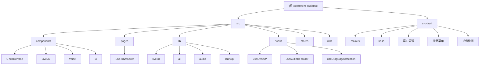

# 项目架构总览

## 架构概述

Reeftotem Assistant 采用 Tauri + React 的混合架构模式，Tauri 提供桌面容器和系统级 API，React 负责用户界面渲染。前后端通过 Tauri events 和 invoke 命令进行事件驱动的通信。

### 技术栈

| 层级 | 技术 |
|------|------|
| 前端框架 | React 19.x + TypeScript |
| 桌面框架 | Tauri 2.x (Rust 后端) |
| UI 组件库 | shadcn/ui + Tailwind CSS 4.x |
| 动画引擎 | Live2D Cubism SDK + WebGL |
| 语音服务 | 腾讯云 ASR/TTS |
| AI 服务 | Ollama 本地部署 |
| 状态管理 | Zustand |
| 构建工具 | Vite 7.x |

## 窗口架构

应用采用双窗口设计：

```
主控制窗口 (main-window)
├── CleanSimpleChat (聊天界面)
│   ├── 对话历史记录
│   ├── 语音输入控制
│   ├── 实时语音波形显示
│   └── 设置面板
├── PersonaDebugger (模型管理)
│   ├── Live2D 模型选择器
│   ├── 模型配置管理
│   └── 实时状态监控
└── AI 配置面板
    ├── 大模型配置
    ├── 语音引擎设置
    └── Agent 行为配置

Live2D 宠物窗口 (live2d-window)
└── Live2DWindow 组件
    └── RealLive2DComponent
        ├── Live2D Core 加载
        ├── LAppDelegate (应用委托)
        ├── LAppLive2DManager (模型管理)
        ├── 唇形同步引擎
        └── Canvas 渲染
```

## 模块结构



## 模块索引

| 模块路径 | 类型 | 主要职责 | 入口文件 | 状态 |
|---------|------|----------|----------|------|
| `src/components/ChatInterface` | React 组件 | 主聊天界面，多标签页交互 | `ChatInterface.tsx` | 核心 |
| `src/components/Live2D` | React 组件 | Live2D 角色渲染和交互 | `Live2DComponents.jsx` | 核心 |
| `src/components/Voice` | React 组件 | 语音录制、识别和合成 | `Live2DVoiceInteraction.tsx` | 核心 |
| `src/pages/Live2DWindow` | React 页面 | Live2D 独立窗口页面 | `Live2DWindow.tsx` | 核心 |
| `src/lib/live2d` | TS 库 | Live2D SDK 封装和核心逻辑 | `Live2DManager.ts` | 核心 |
| `src/lib/ai` | TS 库 | AI 语音服务集成 | `TencentCloudVoiceService.ts` | 核心 |
| `src-tauri/src` | Rust 库 | 桌面应用后端功能 | `lib.rs` | 核心 |
| `src/hooks` | React Hooks | 可复用的状态和逻辑 | `useAudioRecorder.ts` | 成熟 |
| `src/stores` | 状态管理 | 全局状态管理 | `chat-store.ts` | 成熟 |
| `src/utils` | 工具函数 | 通用工具和辅助函数 | `edgeCollisionDetector.ts` | 基础 |

## 通信模式

### Tauri 命令调用

```typescript
import { invoke } from '@tauri-apps/api/core';
const result = await invoke('command_name', { param: value });
```

### 事件监听

```typescript
import { listen } from '@tauri-apps/api/event';
useEffect(() => {
  const unlisten = listen('event_name', handleEvent);
  return () => unlisten();
}, []);
```

### Live2D 初始化

```typescript
const { loadLive2DCore } = useLive2DCore();
const { initializeLive2D } = useLive2DInit(loadLive2DCore);
```

### PCM 录音

```typescript
const { state, startRecording, stopRecording } = usePCMRecorder();
await startRecording();
const pcmData = await stopRecording();
```

## 编码规范

### TypeScript
- 使用严格模式 (`strict: true`)
- 优先使用 `interface` 而非 `type`
- 明确的函数返回类型注解

### React
- 使用函数组件和 Hooks
- 遵循单一职责原则
- Props 类型定义完整

### Rust
- 使用 `rustfmt` 格式化代码
- 遵循 Rust 命名约定
- 使用 `clippy` 检查代码质量

### 文件命名
- React 组件: `PascalCase.tsx`
- 工具函数: `camelCase.ts`
- 常量文件: `kebab-case.ts`

---

*最后更新: 2026-02-19*
